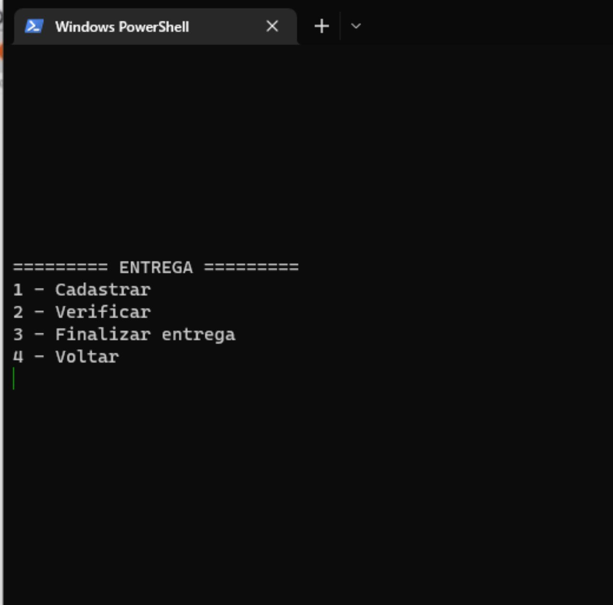
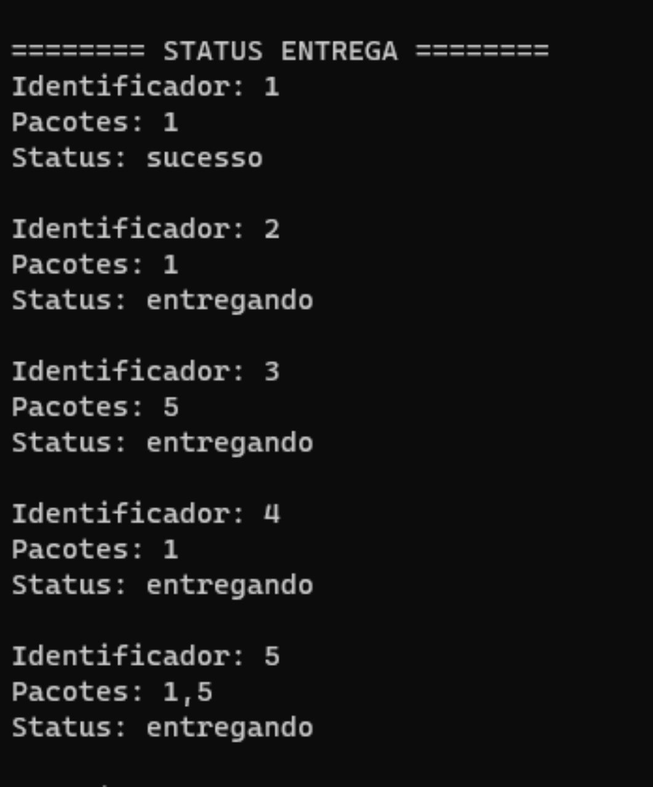
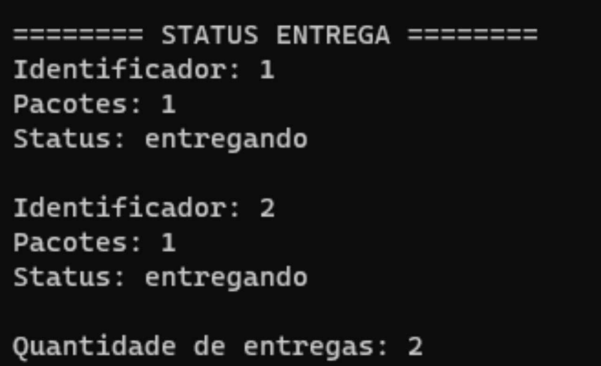

# Jão Delivery

**Disciplina**: FGA0210 - PARADIGMAS DE PROGRAMAÇÃO - T01 <br>
**Nro do Grupo**: 05<br>
**Paradigma**: Funcional<br>

## Alunos
|Matrícula | Aluno |
| -- | -- |
| 180041592  |  Denys Rogeres Leles dos Santos |
| 180113259  |  Felipe Correia Andrade |
| 180103580  |  Jonathan Jorge Barbosa Oliveira|
| 180125885  |  Lucas Melo dos Santos |
| 180127535  |  Mateus Brandao Teixeira |
| 180106821  |  Mateus Gomes do Nascimento |
| 180127641  |  Matheus Afonso de Souza |
| 180138545  |  Thiago Mesquita Peres Nunes de Carvalho |
| 180132245  |  Vinicius de Sousa Saturnino |

## Sobre 
Este software é um sistema de envio de mercadorias onde pessoas podem enviar seus pacotes da forma mais ágil acompanhando a trajetoria e o status deles até o destinatário. 


## Screenshots



## Instalação 
É necessário instalar as seguintes ferramentas para rodar o programa:
- GHC
- cabal-install
- stack
- haskell-language-server(opcional)
  
Para instalar, basta seguir o tutorial disponível no [site do Haskell](https://www.haskell.org/downloads/), e em seguida, entrar no diretório do projeto e executar o seguinte comando no terminal:

```bash
make run
```

**Linguagens**: Haskell<br>
**Tecnologias**: Haskell<br>

## Uso 
Entre no software, e cadestre seu pacote a partir do menu de cadastro (opção "1"). Após isso, vá para a entrega (opção "2"), onde será selecionando os pacotes que serão entregues. Com isso é possível verificar o status de entrega no menu de "entrega" (opção "3"). E o status da mercadoria pode ser alterado para "Sucesso" (Produto entregue com sucesso), "Falha" (Produto entregue com falha) ou "Cancelar" (Cancelar a entrega do produto).





## Vídeo
Adicione 1 ou mais vídeos com a execução do projeto.
Procure: 
(i) Introduzir o projeto;
(ii) Mostrar passo a passo o código, explicando-o, e deixando claro o que é de terceiros, e o que é contribuição real da equipe;
(iii) Apresentar particularidades do Paradigma, da Linguagem, e das Tecnologias, e
(iV) Apresentar lições aprendidas, contribuições, pendências, e ideias para trabalhos futuros.
OBS: TODOS DEVEM PARTICIPAR, CONFERINDO PONTOS DE VISTA.
TEMPO: +/- 15min

## Participações
Apresente, brevemente, como cada membro do grupo contribuiu para o projeto.
|Nome do Membro | Contribuição | Significância da Contribuição para o Projeto (Excelente/Boa/Regular/Ruim/Nula) |
| -- | -- | -- |
| Denys Rogeres Leles dos Santos  |  --- | --- |
| Felipe Correia Andrade  |  Ajudei na documentação e revisei as outras funções. Não pude ajudar muito por causa do tamanho do escopo e pq já haviam feito quase tudo| Regular  |
| Jonathan Jorge Barbosa Oliveira  |  Implementação do fluxo de criar pacote, verificar pacote, formatar as entradas e saídas dos dados, criação de entrega e criação dos dados para popular o grafo. | Excelente |
| Lucas Melo dos Santos  |  --- | --- |
| Mateus Brandao Teixeira  |Implementação do fluxo de criar entrega, verificar entregas, finalizar entrega, da listagem de pacotes e entregas e menus.| Excelente |
| Mateus Gomes do Nascimento  |  Implementação do fluxo de criar entrega, verificar entrega, finalizar entrega, atualizar status das entregas e pacotes, dos menus e da listagem de pacotes e entregas. | Excelente |
| Matheus Afonso de Souza  |  Implementação da estrutura do grafo, do algoritmo de Dijkstra, do fluxo de calcular melhor rota, das funções de leitura e escrita em arquivos, dos menus e da criação dos dados para popular o grafo. | Excelente |
| Thiago Mesquita Peres Nunes de Carvalho  |  Implementação do fluxo de criar entrega, verificar entregas, finalizar entrega, da listagem de pacotes e entregas e menus. | Excelente |
| Vinicius de Sousa Saturnino  |  Implementação do fluxo de criar pacote, verificar pacotes, dos menus e da repetição de escolhas do usuário. | Excelente |

## Outros 
### Lições Aprendidas
Com a execução do projeto, os membros do grupo aprenderam bastante sobre o paradigma funcional, vendo suas vantagens e desvantagens na hora da implementação. Além disso, utilizando esse paradigma os membros tiveram o desafio de pensar de forma diferente do que estavam acostumados e foi um exercício interessante para melhorar na programação e também entender novos paradigmas, para não depender apenas do paradigma que estão mais acostumados.

### Percepções
Depois da execução deste trabalho, os membros do grupo estão mais preparados para aprender novos paradigmas, visto que foi um grande desafio ter que "reprogramar o cérebro" para pensar em um novo paradigma, mas agora o grupo já possui uma experiência neste processo. E além disso, o grupo percebeu que contar apenas com o paradigma mais utilizado no momento pode ser uma estratégia perigosa, porque o mercado e as tecnologias podem mudar a qualquer momento com um novo paradigma, e por conta disso, saber aprender um novo paradigma é muito importante.

### Contribuições e Fragilidades
Com o desenvolvimento do projeto, foi evidente que no início o grupo teve uma grande dificuldade de contribuir com o projeto, visto que é uma linguagem e um paradigma novos para os membros. Mas ao decorrer do projeto, o entendimento do grupo aumentou sobre a linguagem e sobre o paradigma, e as contribuições ficaram mais fáceis de se fazer e o projeto pôde ser concluído.

### Trabalhos Futuros
Ao longo do desenvolvimento do projeto, o grupo percebeu que, embora as desvantagens de um paradigma novo sejam bem evidentes no início, por se tratar de uma nova forma de pensar, cada paradigma possui suas vantagens e desvantagens, e na hora de implementar um novo trabalho, é importante escolher um paradigma levando em conta estas vantagens e desvantagens.

## Fontes
Para a elaboração do grafo e implementação do algoritmo de dijkstra, o qual foi utilizado para busca no grafo, utilizamos o [seguinte repositório](https://github.com/ddrake/haskell-dijkstra) como exemplo, assim, facilitando no desenvolvimento e utilização da estrutura de dados.
